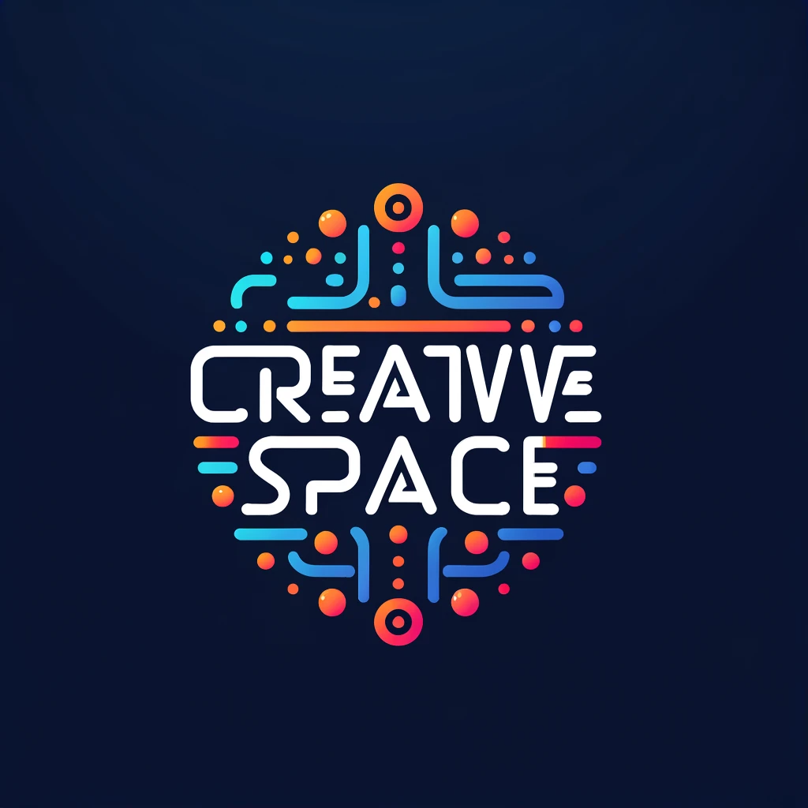

<p align="center">
  
  <h1 align="center">Creative Space</h1>
</p>


# Introduction

Welcome to **Creative Space** - a collaborative, open-source playground for programmers and innovators. If you're looking for a space to unleash your creativity, share ideas, and work alongside fellow programmers, you've come to the right place.

## Why Join Creative Space?

1. **Foster Growth**: Engaging in collaborative projects is a great way to enhance your skills. By joining Creative Space, you get to work with diverse minds, learn new approaches, and tackle interesting challenges.

2. **Innovation Hub**: This is a place for unbridled creativity. Whether you're working on a groundbreaking algorithm, a unique app, or just experimenting with new programming concepts, Creative Space is your canvas.

3. **Community Support**: You're not alone here. Creative Space is about teamwork, support, and collective problem-solving. Have a question or need feedback? The community is here to help.

4. **Showcase Your Work**: This is your stage to shine. Show off your skills, contribute to exciting projects, and build a portfolio that stands out.

5. **Open Source Contribution**: Contributing to open-source projects can be incredibly rewarding. It's a way to give back to the community, improve your coding skills, and even get noticed by potential employers.

## 🏆 Achievements

Joining **Creative Space** isn't just about collaborative projects and innovation; it's also a fantastic opportunity to earn some impressive **GitHub Achievements**! By contributing to the space, you're not only showcasing your skills but also enhancing your GitHub profile.

Check out this list of possible GitHub Achievements and imagine the potential badges you can add to your profile: [GitHub Achievements Guide](https://github.com/drknzz/GitHub-Achievements/blob/main/README.md).

So, let's code, collaborate, and conquer those achievements together! 🌟🚀


## How to Get Involved

1. **Explore Existing Projects**: Take a look at the ongoing projects in the repo. Feel free to contribute to any project that interests you.

2. **Start Your Own Project**: Have an idea? Great! Start a new project and invite others to collaborate.

3. **Join the Discussion**: Participate in discussions, provide feedback, and share ideas to help shape the future of the projects.

4. **Stay Updated**: Keep an eye on the project boards and issue trackers to stay in the loop with what's happening.

5. **Follow Our Guidelines**: Please read our [Contribution Guidelines](LINK_TO_CONTRIBUTION_GUIDELINES) to understand the best practices for contributing to this repo.

## Getting Started

To get started with Creative Space, simply fork this repository, clone it to your local machine, and you're ready to go!

```bash
git clone https://github.com/XSiya/Creative-Space.git
cd Creative-Space
```
Begin by exploring the directories, each representing a different project. You can add to these projects or create a new directory for your own project.

Connect with Us
Got questions or suggestions? Feel free to open an issue or reach out to the maintainers directly.

Let's build something amazing together in Creative Space!

---

Remember, your creativity is the limit here. Let's innovate, collaborate, and grow together!

You can customize this template to better fit the specifics of your project and community. Also, don't forget to add links to your contribution guidelines and other important resources.
